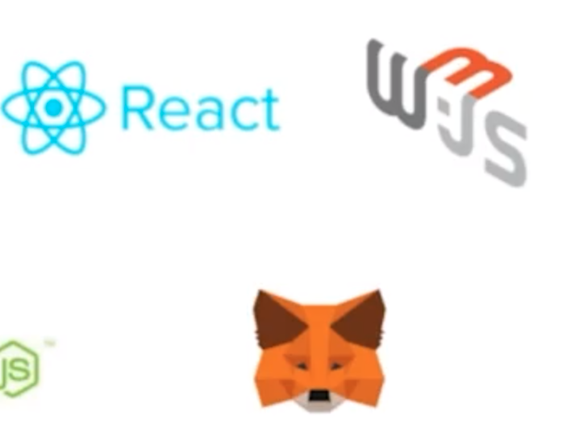

*Second project attempt, carried out step by step, using what was learned in the workshops and taking it to the next level for Chainlink Fall 2021 Hackathon.*
_Team: [Pinajmr](https://www.linkedin.com/in/pinajmr/) Dev and [Sarap](https://www.linkedin.com/in/sarahrappeneau/) UI & UX. Feel free to make a contribution or correction, beginner project._

#  to new world - NFT Collectible

#### When the developments of taking the rover to Mars had been a challenge, they did not imagine who were the first 2048 Humas in this crew, they all have completely random aspects and attributes using Oracles, be part of this new adventure.

##### [Link to backend repository](https://github.com/pinajmr/NFT-Collectible-Humans-Interface)
##### [Link to site humans.eth](https://bafybeihlpe7kpnaifm7tn4jdrm6z2kzc44kl6kvm5axhwnyz5tormchdpq.ipfs.infura-ipfs.io/#/)

#### Technology used

### Contract address
Our deployed contract on the Mumbai Polygon Testnet can be found the last beta version [here](https://mumbai.polygonscan.com/address/0x481cc04ef52038B7b8157419D8F7e2D88A27e791).

### Donations

* <strong>ETH: </strong>0x4317c44fD3143D8AC5723865CF046238A2cd8FD3

